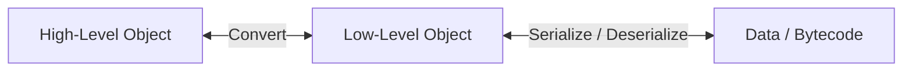

# AnvilASM

**A high-level library for reading, modifying, and generating JVM bytecode.**

AnvilASM is a modern successor to SharpASM, designed to make JVM bytecode manipulation intuitive and developer-friendly within the .NET ecosystem.

## 💡 Design Philosophy

Unlike traditional stream-based parsers (such as the Visitor pattern often found in Java libraries), AnvilASM is built around a **High-Level Object Model**. The library abstracts the complexities of the raw binary format into a structured, easily navigable hierarchy.

The workflow is straightforward:

1.  **Parse**: Converts raw JVM bytecode (`.class` files) into a rich high-level data structure.
2.  **Modify**: Access and edit class elements (constants, methods, fields, instructions) directly, using standard C# collections like Dictionaries and Arrays.
3.  **Build**: Reconstructs valid JVM bytecode from the modified structure, handling serialization details automatically.

## 🏗️ Architecture: High-Level vs. Low-Level

AnvilASM bridges the gap between developer usability and raw binary structure through a two-layer object model. The data flow is structured as follows:

> **High-Level Object <---> Low-Level Object (Serialization/Deserialization) <---> Data**

*   **High-Level Objects**: These are the user-facing objects you interact with (e.g., `ClassNode`, `MethodNode`). They abstract away complexities like Constant Pool indices, turning them into direct references and standard C# types.
*   **Low-Level Objects**: These objects serve as a direct mapping of the JVM ClassFile structure. They represent the raw `u1`, `u2`, `u4` data types and strict structural layout required by the JVM specification.
*   **Transformation**:
    *   **Deserialization**: Raw `Data` is read into Low-Level Objects, which are then resolved into High-Level Objects for editing.
    *   **Serialization**: Your modified High-Level Objects are converted back into Low-Level Objects (rebuilding the Constant Pool), which are then serialized into the final binary `Data`.

## ⚠️ Important Note

This project is currently under active development and reconstruction.

If you attempt to run the generated bytecode on a JVM during this phase, you may need to disable the bytecode verifier (e.g., using `-Xverify:none` or `-noverify`) as the output may not yet fully comply with strict JVM verification constraints. **It is not recommended for production use at this stage.**

## 📄 License

This project is licensed under the **Apache License 2.0**.
